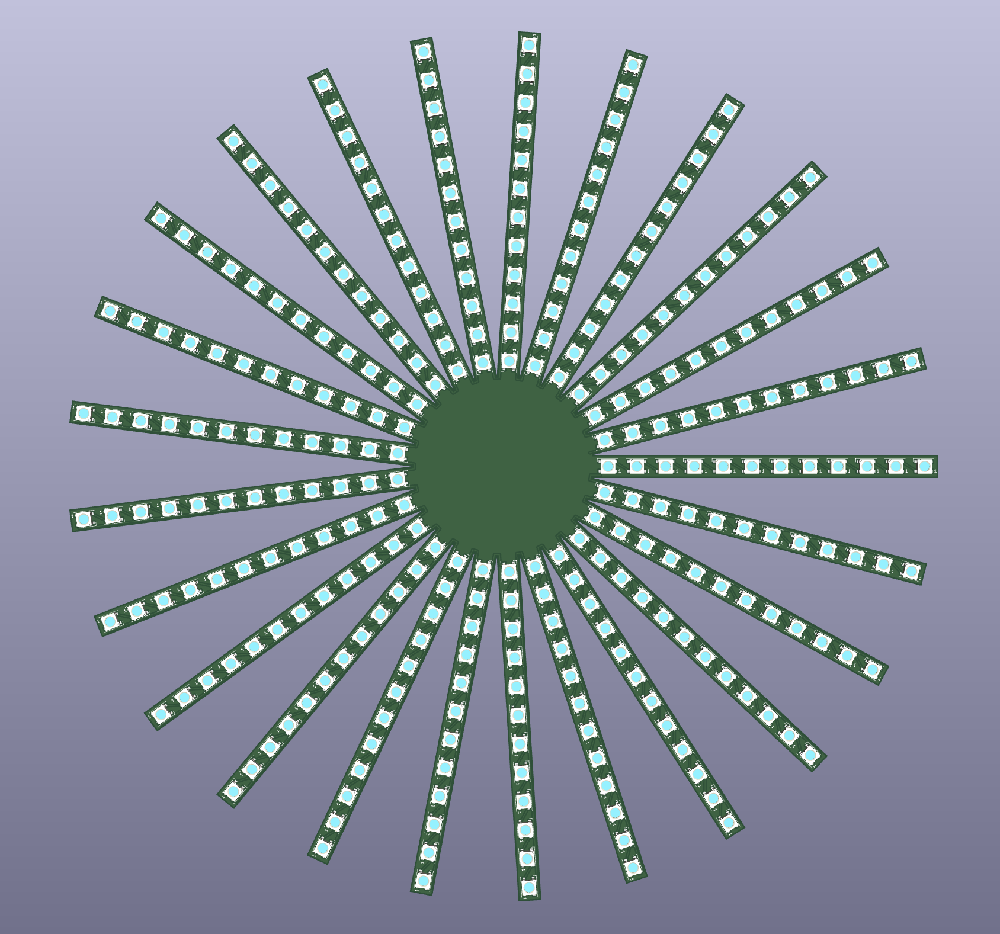
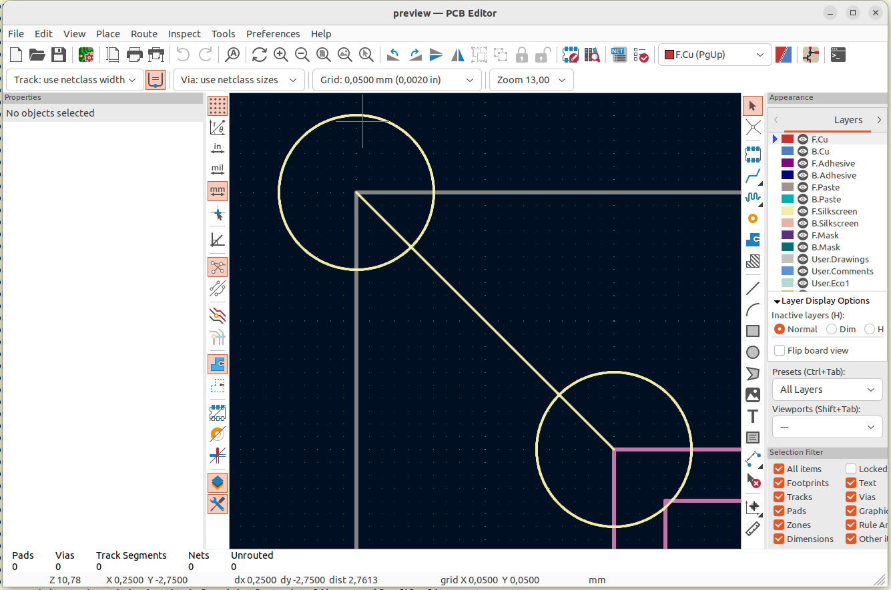
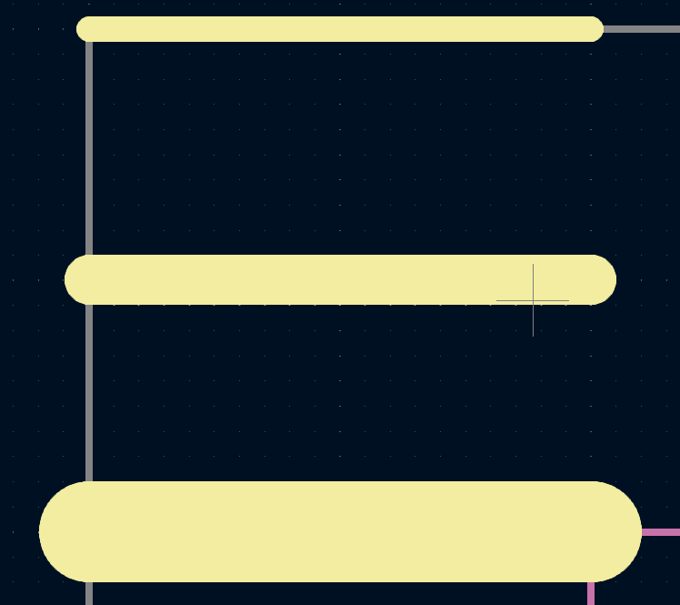
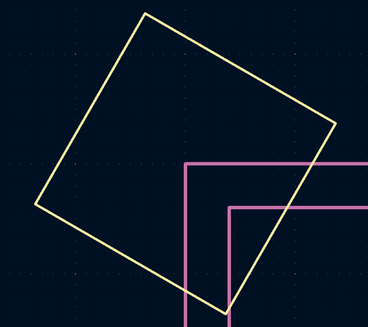
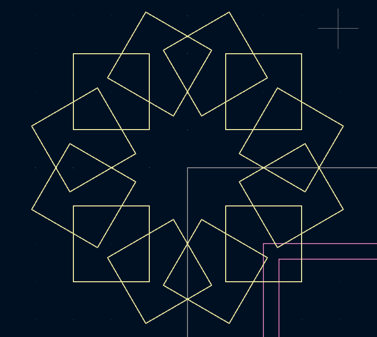
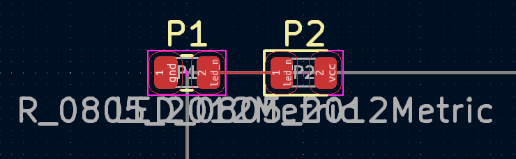
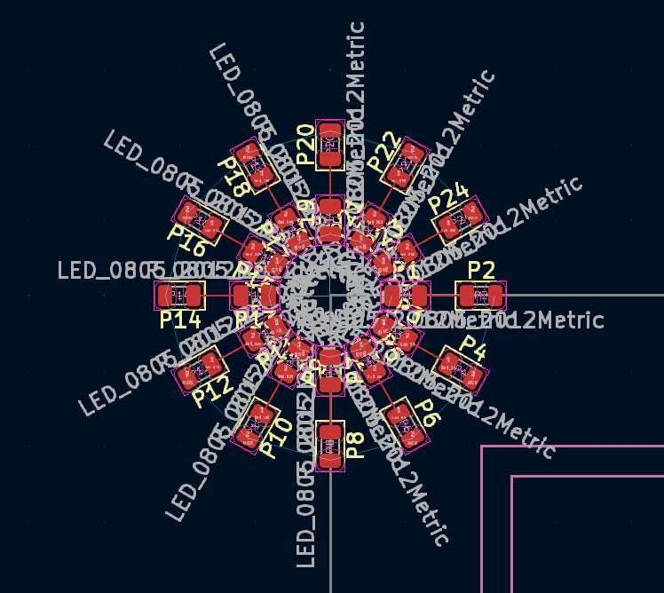
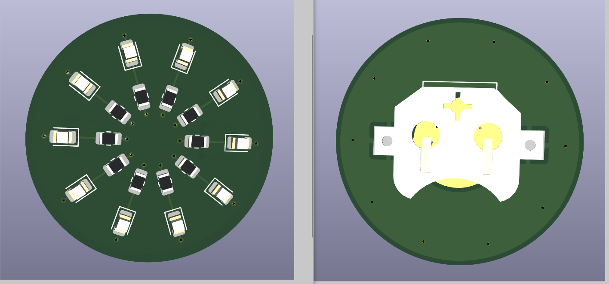

# Circuit Painter

Circuit painter is a creative coding tool for making functional printed
circuit boards.

Inspired by the simplifed drawing language of Processing, this tool provides
an environment for designing PCBs using basic geometric shapes such as lines,
arcs, and polygons. The tool maintains a drawing 'context' that applies a
translation and rotation matrix to all calls, making it simple to replicate
circuit features at differnt points across a circuit board. Functional PCB
components such as part footprints can also be placed, and connected together
logically using 'nets'.

Circuit painter works as a front end / wrapper for [KiCad's pcbnew](https://www.kicad.org/).

# Installation

Release versions are available on PyPi:

    pip install circuitpainter

In addition to the python library, you'll also need KiCad 7.x. The library is
tested on Ubuntu 22.04, with KiCad 7.0.6 installed from theofficial package
(https://www.kicad.org/download/), and Python 3.10.7 (the Ubuntu default).

It should work with any Linux distro,  and might work in Mac/Windows if the
pcbnew library is set up correctly in Python. It should also work with any
recent version of Python 3, but will probably only work with KiCad 7.0.6 or
higher as their API is not stable.

# Example usage

Start by creating a drawing context:

	from circuitpainter import CircuitPainter
	painter = CircuitPainter()

Using the painter object, you can draw non-conductive and conductve shapes,
footprints, and text onto the PCB.

First, set the layer to place the object on (tip: use
print(painter.layers.keys()) to show all available layers):

	painter.layer('F_SilkS')

Next, draw some non-conductive objects:

	painter.circle(0,0,3) # Draw a circle with radius 3 at the board origin
	painter.line(0,0,10,10) # Draw a line from the board origin to (10,10)
	painter.circle(10,10,3) # Draw a circle with raidus 3 at position (10,10)

So far, there hasn't been any visual indication of what you're making.
To get a preview of what your design looks like, use the preview()
function:

	painter.preview()

This will save the design to a temporary location, then open it in the
KiCad editor:

It's good for seeing the project, but be careful! The file
will be deleted (along with any changes you make), as soon as you close
the window. If you do want to save your board at this time, use the 'Save As'
feature before exiting the editor!

To change the width of lines, use the width() command:

	painter.width(0.5)
	painter.line(0,0,10,0) # line with width 0.5mm
	painter.width(1)
	painter.line(0,5,10,5) # line with width 1mm
	painter.width(2)
	painter.line(0,10,10,10) # line with width 2mm

You can change where and at what angle features are added, by using the
translate() and rotate() features:

	painter.translate(10,10)
	painter.rotate(30)
	painter.rect(-5,-5,5,5) # Rectangle is drawn at a 30 degreen angle, centered at (10,10).

Calling them multiple times will stack the transformations (they are
calculated as a 2d transformation matrix)

	painter.translate(10,10)
	painter.rect(-5,-5,5,5) # Rectangle is drawn centered at (10,10).
	painter.translate(10,10)
	painter.rect(-5,-5,5,5) # Rectangle is drawn centered at (20,20).
	painter.translate(10,10)
	painter.rect(-5,-5,5,5) # Rectangle is drawn centered at (30,30).

Saving and restoring the applied tranformation is done using push_matrix()
and pop_matrix(). (Note: This is implemented as a stack, and multiple pushes can be nested):

	for angle in range(0,360,30):
		painter.push_matrix() # Save the current transformation settings
		painter.rotate(angle)
  		painter.translate(10,10)
		painter.rect(-5,-5,5,5)
		painter.pop_matrix() # Restore previous transformation settings

Besides lines and rectangles, there are other basic shapes such as arc(), cirle(), and polygon().

Drawing shapes is ok but the real fun comes from adding components. To add a component,
first use the library editor in KiCad to find the library and footprint name for
the part you want to place. Then, you can add them to your board using the footprint()
command:

	painter.layer('F_Cu')
	painter.footprint(0,0,"LED_SMD","LED_0805_2012Metric")

This placed the part, but it won't work well as a part- it's not wired up, so it
won't actually function! Let's add some nets, and a resistor because that
is nicer to the LED. Note that CircuitPainter doesn't know or care about what net
names you assign to what footprints, so be sure to double or triple check that
your circuit is correct:

	painter.layer('F_Cu')
	painter.footprint(0,0,"Resistor_SMD","R_0805_2012Metric",nets=['gnd','led_n'])
	painter.footprint(5,0,"LED_SMD","LED_0805_2012Metric",nets=['led_n','vcc'])
	painter.track(1,0,4,0)

Note: In this example, we are manually drawing a track that just happens to line up
with the centers of the two pads that we want to connect. To see a more exact way
to accomplish this by looking up the positions of each pad, see the asterix example
project.
q
Also note that we didn't specify a net name to assign to the track. pcbnew is able
to figure this out because the starting postiion of the track overlapped with the
second resistor pad, so it assigned the same net to track.	

One LED and resistor is cool, but not that impressive (and honestly more work than
just doing it by hand). However, we can put this into a loop and combine it with
the previous translation operations, to make a ring of LEDs:

	for angle in range(0,360,30):
		painter.push_matrix()
		painter.rotate(angle) # Rotation and translation for the next resistor/led combination
	 	painter.translate(5,0)
   		painter.layer('F_Cu')
		painter.footprint(0,0,"Resistor_SMD","R_0805_2012Metric",nets=['gnd',f'led_{angle}'])
		painter.footprint(5,0,"LED_SMD","LED_0805_2012Metric",nets=[f'led_{angle}','vcc'])
		painter.track(1,0,4,0)

		painter.pop_matrix()
  

Not bad for a few lines of code!

To make a complete board, here is the [rest of the owl](https://knowyourmeme.com/memes/how-to-draw-an-owl):

	from circuitpainter import CircuitPainter
	painter = CircuitPainter()
	
	painter.no_designators() # Don't show reference designator names on the board silkscreen
	painter.layer('F_Cu')
	painter.width(.2)
	
	for angle in range(0,360,36):
	    painter.push_matrix() # Save the current transformation settings
	    painter.rotate(angle)
	    painter.translate(5,0)
	    painter.footprint(0,0,"Resistor_SMD","R_0805_2012Metric",nets=['gnd',f'led_{angle}'])
	    painter.footprint(5,0,"LED_SMD","LED_0805_2012Metric",nets=[f'led_{angle}','vcc'])
	    painter.track(1,0,4,0) # Connect the resistor to the LED
	    painter.track(-1,0,-2,0) # Connect the resistor to ground
	    painter.via(-2,0)
	    painter.track(6,0,7,0) # Connect the LED to vcc
	    painter.via(7,0)
	    painter.pop_matrix()
	
	# Fill the back of the board with a copper zone, and assign it to the 'vcc' net
	painter.layer('B_Cu')
	painter.circle_zone(0,0,14,net='vcc')
	
	# Add a battery connector to the back
	painter.layer('B_Cu')
	painter.footprint(0,0,"Battery","BatteryHolder_Keystone_3000_1x12mm",nets=['vcc','vcc','gnd'])

 	# Make the board shape to a circle
	painter.layer("Edge_Cuts")
	painter.circle(0,0,14)
	
	painter.preview()

 

Note that we've added a battery connector, vias to connect power and ground from each of the LEDs,
and a circular board edge to make it look a little prettier. It's not a bad idea to check DRC:

One you are satisfied with the design, you can either save it for further editing in KiCad
with the .save() command, or go straight to a gerber with the .export_gerber() command.

For more complete examples, see the scripts in the examples directory.

# Advanced usage

The goal of circuitpainter is to make the most common parts of PCB generation
easy, and you might want to do things that this API doesn't directly support.

Note that the underlying pcbnew API is not finished, and will likely be
different between even minor KiCad versions. Using the python help() function
on these object references is a good way to explore their options, though it
gets complicated because they are themselves thin wrappers over the C-language
pcbnew library. Eventually, you'll need to dig through the KiCad source
to figure out how things are supposed to work, and don't forget to check the
bug tracker if things aren't working correctly, because it probably is a bug
and there might be a workaround / fix.

## Extended object properties

Circuit painter aims to keep circuit creation simple, but there are extra configuration
settings on many objects that you might want access to. To facilitate this, all
functions that create a PCB object will also return a reference to that object,
so that you can modify it.

For example, create a rectangular zone, and save the reference to it:

    painter.layer("F_Cu") 
    zone = painter.rect_zone(0,0,10,10)

Then, modify the zone properties using the pcbnew api:

    zone.SetIsRuleArea(True)
    zone.SetDoNotAllowCopperPour(True)
    zone.SetDoNotAllowVias(False)
    zone.SetDoNotAllowTracks(False)
    zone.SetDoNotAllowPads(False)

## Board configuration

Many of the board configuration options (stackup, DRC rules, etc) are
stored in the board design settings. For example, to create a 4-layer board
with some different DRC settings:

    import pcbnew
    settings = painter.pcb.GetDesignSettings()
    settings.SetCopperLayerCount(4) # Change to a 4-layer board design
    settings.m_CopperEdgeClearance = pcbnew.FromMM(0.1) # Set the copper-to-edge spacing to 0.1mm

Note that we are importing 'pcbnew' here, in order to use the FromMM() function
to convert a measurement from mm to KiCad's internal units.

## Updating boards / adding manual edits

Circuit Painter is great for automating parts of designs that are highly repetitive,
but is less effective for more mundane tasks such as wiring up a fancy LED array to
a microcontroller. On this end, everything that CircuitPainter creates is placed into
a single group. When you make manual additions to the board, be sure not to put your
changes into the auto-generated group. Later, if you want to re-generate the automated
portion of your design, you should be able to just delete that group, then start
Circuit Painter by passing it the file name:

	painter = CircuitPainter('my_file.kicad_pcb')

New objects will then be added to that board, in a new group.

# Notes

Wishlist:

* Cooler examples: Fractals such as Apollonian gasket, Sierpinski triangles, Fibonacci spirals?
* Font configuration: Configure a text-type, and have it auto-apply whenever text is drawn (similar to this: https://processing.org/reference/textFont_.html )
* Some way to generate schematics, even if they are terrible and just have each component drawn out separtely, with small wires and net names on each port.
* Place components on path: tool for placing evenly-spaced footprints along a path
* 'Fill' region with equally-spaced or patterned components

Similar nontraditional PCB design tools:

* [SVG-PCB](https://leomcelroy.com/svg-pcb-website/)
* [SVG2Shenzhen](https://github.com/badgeek/svg2shenzhen)

# Credits

CircuitPainter is a simplified interface for KiCad's
[PcbNew](https://www.kicad.org/discover/pcb-design/) library. Their library
does all of the heavy lifting in actually making the PCBs.

CircuitPainter was written by [Matthew Mets](https://github.com/cibomahto)
