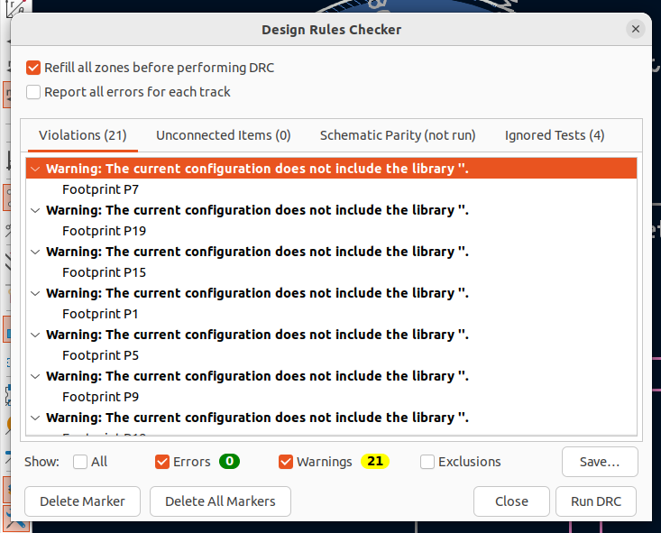

Getting Started Tutorial
========================

This tutorial will walk you through some of the basic concepts in Circuit
Painter. If you haven't set up your environment yet, follow the instructions
in the :doc:`installation` section, then type the following commands into a
circuitpainter-enabled Python interpreter.

Start by creating a drawing context:

   .. code:: python

		from circuitpainter import CircuitPainter
		p = CircuitPainter()

Using the painter object, you can draw non-conductive and conductve shapes,
footprints, and text onto the PCB.

First, set the layer to place the object on (tip: use
print(p.layers.keys()) to show all available layers):

	.. code:: python

		p.layer('F_SilkS')

Next, draw some non-conductive objects:

	.. code:: python

		p.circle(0,0,3) # Draw a circle with radius 3 at the board origin
		p.line(0,0,10,10) # Draw a line from the board origin to (10,10)
		p.circle(10,10,3) # Draw a circle with raidus 3 at position (10,10)

So far, there hasn't been any visual indication of what you're making.
To get a preview of what your design looks like, use the preview()
function:

	.. code:: python
	
		p.preview()

This will save the design to a temporary location, then open it in the
KiCad editor:

 .. image:: _static/images/example-two-lines.png
  :width: 600

It's good for seeing the project, but be careful! The file
will be deleted (along with any changes you make), as soon as you close
the window. If you do want to save your board at this time, use the 'Save As'
feature before exiting the editor!

To change the width of lines, use the width() command:

	.. code:: python

		p.width(0.5)
		p.line(0,0,10,0) # line with width 0.5mm
		p.width(1)
		p.line(0,5,10,5) # line with width 1mm
		p.width(2)
		p.line(0,10,10,10) # line with width 2mm

 .. image:: _static/images/example-line-widths.png
  :width: 600

You can change where and at what angle features are added, by using the
translate() and rotate() features:

	.. code:: python

		p.translate(10,10)
		p.rotate(30)
		p.rect(-5,-5,5,5) # Rectangle is drawn at a 30 degreen angle, centered at (10,10).

 .. image:: _static/images/example-rotate-rect.png
  :width: 600

Calling them multiple times will stack the transformations (they are
calculated as a 2d transformation matrix)
	
	.. code:: python

		p.translate(10,10)
		p.rect(-5,-5,5,5) # Rectangle is drawn centered at (10,10).
		p.translate(10,10)
		p.rect(-5,-5,5,5) # Rectangle is drawn centered at (20,20).
		p.translate(10,10)
		p.rect(-5,-5,5,5) # Rectangle is drawn centered at (30,30).

 .. image:: _static/images/example-translate-rect.png
  :width: 600

Saving and restoring the applied tranformation is done using push_matrix()
and pop_matrix(). (Note: This is implemented as a stack, and multiple pushes can be nested):

	.. code:: python
	
		for angle in range(0,360,30):
			p.push_matrix() # Save the current transformation settings
			p.rotate(angle)
			p.translate(10,10)
			p.rect(-5,-5,5,5)
			p.pop_matrix() # Restore previous transformation settings

 .. image:: _static/images/example-push-pop-rect.png
  :width: 600

Besides lines and rectangles, there are other basic shapes such as arc(), cirle(), and polygon().

Drawing shapes is ok but the real fun comes from adding components. To add a component,
first use the library editor in KiCad to find the library and footprint name for
the part you want to place. Then, you can add them to your board using the footprint()
command:

	.. code:: python
	
		p.layer('F_Cu')
		p.footprint(0,0,"LED_SMD","LED_0805_2012Metric")

 .. image:: _static/images/example-add-led.png
  :width: 600

This placed the part, but it won't work well as a part- it's not wired up, so it
won't actually function! Let's add some nets, and a resistor because that
is nicer to the LED. Note that CircuitPainter doesn't know or care about what net
names you assign to what footprints, so be sure to double or triple check that
your circuit is correct:

	.. code:: python
	
		p.layer('F_Cu')
		p.footprint(0,0,"Resistor_SMD","R_0805_2012Metric",nets=['gnd','led_n'])
		p.footprint(5,0,"LED_SMD","LED_0805_2012Metric",nets=['led_n','vcc'])
		p.track(1,0,4,0)

 .. image:: _static/images/example-connect-led.png
  :width: 600

Note: In this example, we are manually drawing a track that just happens to line up
with the centers of the two pads that we want to connect. To see a more exact way
to accomplish this by looking up the positions of each pad, see the asterix example
project.
q
Also note that we didn't specify a net name to assign to the track. pcbnew is able
to figure this out because the starting postiion of the track overlapped with the
second resistor pad, so it assigned the same net to track.	

One LED and resistor is cool, but not that impressive (and honestly more work than
just doing it by hand). However, we can put this into a loop and combine it with
the previous translation operations, to make a ring of LEDs:

	.. code:: python

		for angle in range(0,360,30):
			p.push_matrix()
			p.rotate(angle) # Rotation and translation for the next resistor/led combination
			p.translate(5,0)
			p.layer('F_Cu')
			p.footprint(0,0,"Resistor_SMD","R_0805_2012Metric",nets=['gnd',f'led_{angle}'])
			p.footprint(5,0,"LED_SMD","LED_0805_2012Metric",nets=[f'led_{angle}','vcc'])
			p.track(1,0,4,0)

			p.pop_matrix()
  
 .. image:: _static/images/example-led-ring.png
  :width: 600

Not bad for a few lines of code!

To make a complete board, here is the [rest of the owl](https://knowyourmeme.com/memes/how-to-draw-an-owl):

	.. code:: python
	
		from circuitpainter import CircuitPainter
		p = CircuitPainter()
		
		p.no_designators() # Don't show reference designator names on the board silkscreen
		p.layer('F_Cu')
		p.width(.2)
		
		for angle in range(0,360,36):
			p.push_matrix() # Save the current transformation settings
			p.rotate(angle)
			p.translate(5,0)
			p.footprint(0,0,"Resistor_SMD","R_0805_2012Metric",nets=['gnd',f'led_{angle}'])
			p.footprint(5,0,"LED_SMD","LED_0805_2012Metric",nets=[f'led_{angle}','vcc'])
			p.track(1,0,4,0) # Connect the resistor to the LED
			p.track(-1,0,-2,0) # Connect the resistor to ground
			p.via(-2,0)
			p.track(6,0,7,0) # Connect the LED to vcc
			p.via(7,0)
			p.pop_matrix()
		
		# Fill the back of the board with a copper zone, and assign it to the 'vcc' net
		p.layer('B_Cu')
		p.circle_zone(0,0,14,net='vcc')
		
		# Add a battery connector to the back
		p.layer('B_Cu')
		p.footprint(0,0,"Battery","BatteryHolder_Keystone_3000_1x12mm",nets=['vcc','vcc','gnd'])

		# Make the board shape to a circle
		p.layer("Edge_Cuts")
		p.circle(0,0,14)
		
		p.preview()

 .. image:: _static/images/example-rest-of-owl.png
  :width: 600

Note that we've added a battery connector, vias to connect power and ground from each of the LEDs,
and a circular board edge to make it look a little prettier. It's not a bad idea to check DRC:

One you are satisfied with the design, you can either save it for further editing in KiCad
with the .save() command, or go straight to a gerber with the .export_gerber() command.

For more complete examples, see the scripts in the examples directory.

.. autosummary::
   :toctree: generated