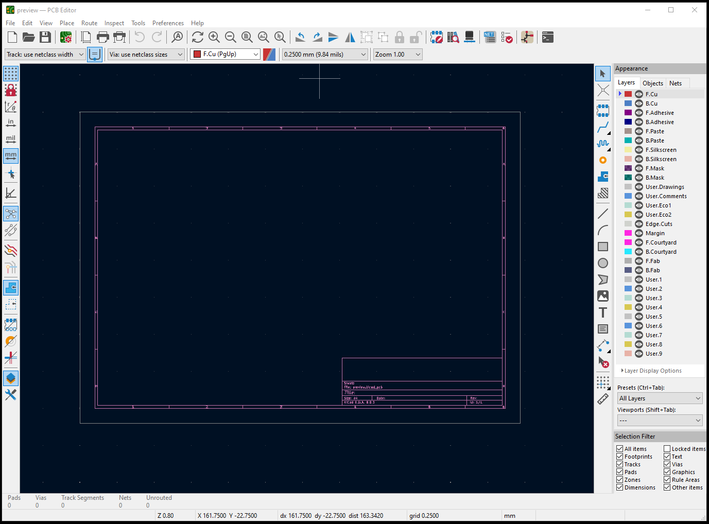

Installation
============

Windows
-------

For Windows, first download and install `KiCad <https://www.kicad.org/download/windows/>`_.
The latest stable release of version 8 is recommended, and the default options are fine.

During the installation, KiCad will make a Start Menu shortcut for the
'KiCad 8.0 Command Prompt':

.. image:: _static/images/install_windows_kicad_prompt.png
  :width: 600

Run this, and you'll be presented with a command prompt that is fully
configured to work with KiCad. From here, you can install CircuitPainter
using Pip:

    .. code:: bat

        pip install circuitpainter

.. image:: _static/images/install_windows_pip.png
  :width: 600

Next, you can run python:

    .. code:: bat

        python

and then type this into the Python terminal, to create an empty board and
show that it's working:

    .. code:: python

        from circuitpainter import CircuitPainter
        p = CircuitPainter()
        p.preview()

.. image:: _static/images/install_windows_empty_board.png
  :width: 600

If everything was set up correctly, you should PCB Editor window pop up,
showing the blank board:

Close the PCB editor, then type exit() into the Python prompt to close it:

    .. code:: python

        exit()

Now, CircuitPainter is set up in the KiCad Command prompt. You can use this
Python shell to run CircuitPainter scripts, or interact directly with the
Python REPL. The installation is permanent, so you don't need to do the
install steps the next time you want to run CircuitPainter- just open the
KiCad Commadn Prompt, and you are good to go.

Note that if you upgrade KiCad, there is a chance that it will update the
version of Python that it shipped with. In that case, you will need to do the
installation process again.

Linux
-----

For Linux, first install `KiCad <https://www.kicad.org/download/linux/>`_ 
using the instructions for your distro. The latest stable release of version 8
is recommended. Note: these instructions were tested with Ubuntu 24.04,
and may need to be adjusted based on the distribution that you're running. In
particular, the flatpack install might be difficult to get working with
Circuitpainter.

In addition to KiCad, you may also need to install python-venv. For Ubuntu:
    
    .. code:: bash

        sudo apt install python3-venv

Once KiCad is installed, open a Terminal window, and create a new directory to work in:

    .. code:: bash

        mkdir circuitpainter && cd "$_"

.. image:: _static/images/install_linux_mkdir.png
  :width: 600

Next, set up a Python `virtual environment <https://docs.python.org/3/tutorial/venv.html>`_,
and activate it. Note that you need to use the option '--system-site-packages',
so that Circuit Painter can find the version of KiCad installed by your package
manager:

    python3 -m venv --system-site-packages venv
    . venv/bin/activate

.. image:: _static/images/install_linux_venv.png
  :width: 600

From here, you can install CircuitPainter using Pip:

    .. code:: bash

        pip install circuitpainter

.. image:: _static/images/install_linux_pip.png
  :width: 600

Next, you can run python:

    .. code:: bash

        python

.. image:: _static/images/install_linux_run_python.png
  :width: 600

and then type this into the Python terminal, to create an empty board and
show that it's working:

    .. code:: python

        from circuitpainter import CircuitPainter
        p = CircuitPainter()
        p.preview()

.. image:: _static/images/install_linux_empty_board.png
  :width: 600

If everything was set up correctly, you should PCB Editor window pop up,
showing the blank board:

Close the PCB editor, then type exit() into the Python prompt to close it:

    .. code:: python

        exit()

.. image:: _static/images/install_linux_close_python.png
  :width: 600

Now, you have a working CircuitPainter installation. To start it again next
time, just open a new terminal window, change to the 'circuitpainter'
directory that you created, and type in '. venv/bin/activate' to enable the
virtual environment.

Note that if you upgrade KiCad, there is a chance that it will update the
version of Python that it shipped with. In that case, you will need to do the
installation process again.

macOS
-----

Unfortunately, the situation on macOS seems to be more complex- the way that
KiCad is bundled appears to make it difficult to install packages into the
Python environment that ships with KiCad. If you have experience with this,
please let us know how to set it up.

.. autosummary::
   :toctree: generated